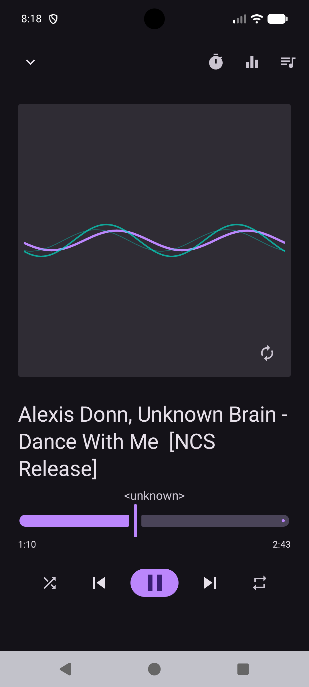
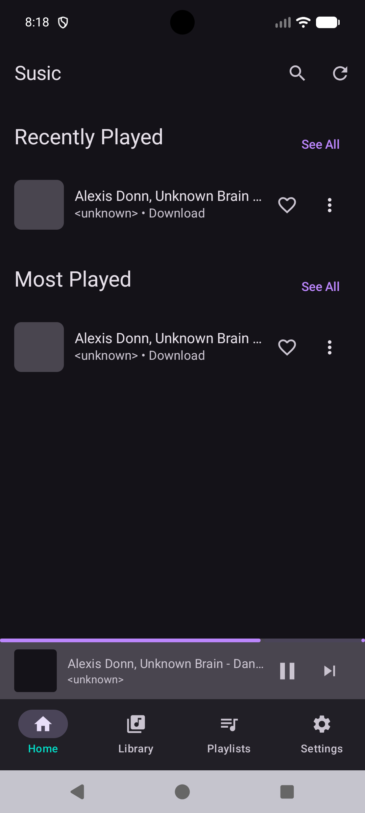
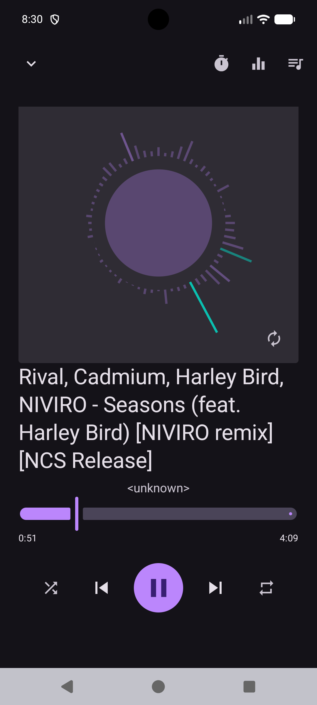
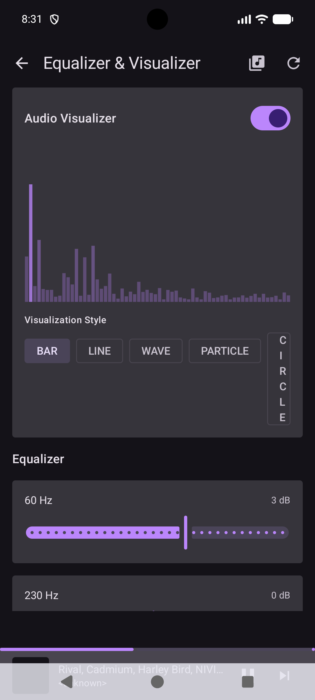

# 🎵 Susic - Offline Music Player

<div align="center">


A modern, feature-rich offline music player for Android built with Jetpack Compose and Material 3 design.

[Features](#-features) • [Architecture](#-architecture) • [Getting Started](#-getting-started) • [Screenshots](#-screenshots) • [Documentation](#-documentation)

</div>

---

## ✨ Features

### 🎼 Playback
- **Foreground Service** - Uninterrupted playback with Media3 ExoPlayer
- **Media Controls** - Play, pause, skip, seek with notification controls
- **Playback Modes** - Shuffle and repeat (off/one/all)
- **Speed Control** - Adjust playback speed from 0.5x to 2.0x
- **Queue Management** - View and manage current play queue
- **Background Playback** - Continue playing when app is minimized

### 📚 Library Management
- **Auto Scan** - Automatically detect music files on device
- **Smart Categories** - Recently played, most played, favorites
- **Search** - Fast real-time search across songs, artists, and albums
- **Play Statistics** - Track play counts and listening history
- **Favorites** - Mark and filter your favorite tracks

### 📋 Playlists
- **Custom Playlists** - Create and manage unlimited playlists
- **Easy Management** - Add/remove songs with intuitive UI
- **Flexible Organization** - Songs can appear in multiple playlists

### ⏰ Sleep Timer
- **Scheduled Pause** - Set timer to automatically pause playback
- **Multiple Durations** - Choose from 5 to 60 minutes
- **Reliable** - Powered by WorkManager for guaranteed execution
- **Notifications** - Get notified when timer expires

### 🎨 Modern UI
- **Material 3 Design** - Beautiful, consistent Material You interface
- **Dark Theme** - Easy on the eyes for night listening
- **Mini Player** - Persistent controls at bottom of screen
- **Album Art** - Beautiful artwork display with Coil image loading
- **Smooth Animations** - Polished transitions and interactions

---

## 🏗️ Architecture

Built with **Clean Architecture** and **MVVM** pattern for maintainability and testability.

```
┌──────────────────────────────────┐
│     UI Layer (Compose)           │
│  Screens, Components, Navigation │
└────────────┬─────────────────────┘
             │ observes StateFlow
┌────────────▼─────────────────────┐
│     ViewModel Layer              │
│  Business Logic, UI State        │
└────────────┬─────────────────────┘
             │ uses
┌────────────▼─────────────────────┐
│     Repository Layer             │
│  Single Source of Truth          │
└────────────┬─────────────────────┘
             │ accesses
┌────────────▼─────────────────────┐
│     Data Sources                 │
│  Room, DataStore, MediaStore     │
└──────────────────────────────────┘
```

### Tech Stack
- **Kotlin** - Modern, concise language
- **Jetpack Compose** - Declarative UI framework
- **Material 3** - Latest design system
- **Media3** - Professional media playback
- **Room** - Type-safe database
- **Coroutines & Flow** - Async operations
- **WorkManager** - Background task scheduling
- **DataStore** - Preferences storage
- **Coil** - Image loading
- **Navigation Compose** - Screen navigation

---

## 🚀 Getting Started

### Prerequisites
- **Android Studio** Hedgehog (2023.1.1) or later
- **Android SDK** API 29 or higher
- **Kotlin** 1.9.0 or higher

### Installation

1. **Clone the repository**
```bash
git clone https://github.com/yourusername/susic.git
cd susic
```

2. **Open in Android Studio**
```
File → Open → Select 'Susic' folder
```

3. **Sync Gradle**
```
File → Sync Project with Gradle Files
```

4. **Run the app**
```
Run → Run 'app' (Shift+F10)
```

### First Launch

1. **Grant Permissions** - Allow access to audio files
2. **Scan Library** - Tap refresh icon to scan device
3. **Start Playing** - Select any song to begin

---

## 📱 Screenshots






---
## 🔐 Permissions

The app requires the following permissions:

- **Storage/Audio** - Read music files from device
- **Foreground Service** - Background playback
- **Notifications** - Media controls and timer alerts
- **Wake Lock** - Prevent sleep during playback

All permissions are requested at runtime with proper rationale.

---

## 🛠️ Development

### Building from Source

```bash
# Debug build
./gradlew assembleDebug

# Release build
./gradlew assembleRelease

# Run tests
./gradlew test
```
## 🧪 Testing

```bash
# Unit tests
./gradlew test

# Instrumented tests
./gradlew connectedAndroidTest
```

---

## 🤝 Contributing

Contributions are welcome! Please feel free to submit a Pull Request.

1. Fork the project
2. Create your feature branch (`git checkout -b feature/AmazingFeature`)
3. Commit your changes (`git commit -m 'Add some AmazingFeature'`)
4. Push to the branch (`git push origin feature/AmazingFeature`)
5. Open a Pull Request

---

## 📋 TODO / Roadmap

- [ ] Android Auto integration
- [ ] Wear OS companion app
- [ ] Equalizer and audio effects
- [ ] Lyrics display
- [ ] Home screen widgets
- [ ] Custom themes
- [ ] Cloud backup
- [ ] Playlist sharing

---

## 📄 License

This project is licensed under the MIT License - see the [LICENSE](LICENSE) file for details.

---

## 🙏 Acknowledgments

- [Jetpack Compose](https://developer.android.com/jetpack/compose) - Modern UI toolkit
- [Material 3](https://m3.material.io/) - Design system
- [Media3](https://developer.android.com/guide/topics/media/media3) - Media playback
- [Room](https://developer.android.com/training/data-storage/room) - Database library
- [Coil](https://coil-kt.github.io/coil/) - Image loading

---

## 📧 Contact

For questions or feedback, please open an issue on GitHub.

---

<div align="center">

**Made with ❤️ using Kotlin and Jetpack Compose**

⭐ Star this repo if you find it helpful!

</div>
: A Music player app with seamlessly visualization

